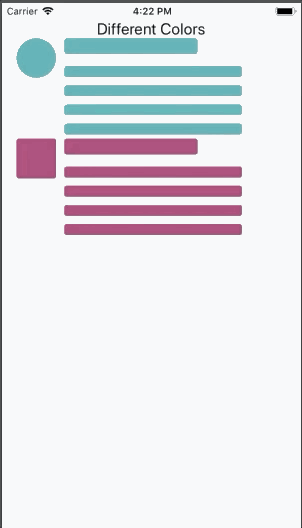

[![NPM Version][npm-image]][npm-url]
[![Downloads Stats][npm-downloads]][npm-url]

## react-native-easy-content-loader

Provide a placeholder at the place which need waiting for loading,
Easy to implement and fun to use

  

## Installation

```sh
npm install react-native-easy-content-loader --save
yarn add react-native-easy-content-loader
```

## When Should we Use it

When resource needs long time to load, like low network speed.
The component contains much information. Such as List.
Only works when loading data at first time.

Could be replaced by Spin in all situation, but provide better user experience than spin if it works.

```js
import ContentLoader from "react-native-easy-content-loader";
```

## Simple Example

```jsx
<ContentLoader active />
```

## With Avatar

```jsx
<ContentLoader active avatar />
```

## With Loading State

```jsx
<ContentLoader active avatar loading={this.state.loading}>
  <Text>This would be rendered with loading is false</Text>
</ContentLoader>
```

## Number of paragraphs

```jsx
<ContentLoader active avatar pRows={4} />
```

## Different Widths for differnt paragrahs lines

```jsx
<ContentLoader active avatar pRows={4} pWidth={["100%", 200, "25%", 45]} />
```

For more examples
https://snack.expo.io/@sarmad1995/cHJpdm

## API

## Title

| Props         | Default | Required |        Type        | Note                                              |
| :------------ | :-----: | :------: | :----------------: | :------------------------------------------------ |
| `title`       | `true`  |   `NO`   |       `bool`       | If true, It will display a placeholder for title. |
| `tHeight`     |  `20`   |   `NO`   | `number or string` | Title height.                                     |
| `tWidth`      |  `60%`  |   `NO`   | `number or string` | Title width.                                      |
| `titleStyles` |   `-`   |   `NO`   |      `styles`      | If you want to overide title styles`.             |

## Paragraph

| Props             | Default | Required |                    Type                    | Note                                                                                                     |
| :---------------- | :-----: | :------: | :----------------------------------------: | :------------------------------------------------------------------------------------------------------- |
| `paragraph`       | `true`  |   `NO`   |                   `bool`                   | If true, It will display a placeholder for paragraph.                                                    |
| `pHeight`         |  `20`   |   `NO`   |             `number or string`             | Paragraph line height.                                                                                   |
| `pWidth`          |  `60%`  |   `NO`   | `number or array of number or percentages` | Can specify same width with single value, Or could use array for different widths, eg ['100%', 200, 300] |
| `paragraphStyles` |   `-`   |   `NO`   |                  `styles`                  | If you want to overide paragraph styles`.                                                                |

## Avatar

| Props             |  Default  | Required |                 Type                  | Note                                               |
| :---------------- | :-------: | :------: | :-----------------------------------: | :------------------------------------------------- |
| `avatar`          |  `false`  |   `NO`   |                `bool`                 | If true, It will display a placeholder for avatar. |
| `aSize`           | `default` |   `NO`   | `'default' 'small' 'large' or number` | avatar size.                                       |
| `aShape`          | `circle`  |   `NO`   |          `'circle' 'square'`          | Shape of avatar.                                   |
| `reverse`         |  `false`  |   `NO`   |                `bool`                 | Avatar would be rendered on right side.            |
| `paragraphStyles` |    `-`    |   `NO`   |               `styles`                | If you want to overide paragraph styles`.          |

## Config

| Props               |         Default          | Required |   Type   | Note                                                        |
| :------------------ | :----------------------: | :------: | :------: | :---------------------------------------------------------- |
| `loading`           |          `null`          |   `NO`   |  `bool`  | if set, then it will render children when loading is false. |
| `primaryColor`      | `rgba(195, 191, 191, 1)` |   `NO`   |  `rgba`  | primary color.                                              |
| `secondaryColor`    | `rgba(218, 215, 215, 1)` |   `NO`   |  `rgba`  | secondary color.                                            |
| `animationDuration` |          `500`           |   `NO`   | `number` | Animation duration during active.                           |

## Release History

- 0.0.5
  - Beta
- 0.0.1
  - Work in progress

## Contributing

Feel free to contribute, this is still in beta and I have plans to include more features in future :)

<!-- Markdown link & img dfn's -->

[npm-image]: https://img.shields.io/npm/v/react-native-easy-content-loader.svg
[npm-url]: https://www.npmjs.com/search?q=react-native-easy-content-loader
[npm-downloads]: https://img.shields.io/npm/dm/react-native-easy-content-loader.svg?style=flat-square
